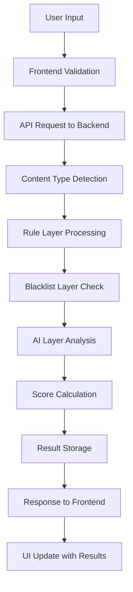

# ScamShield Architecture Overview 🏗️

> This document provides a detailed, end-to-end explanation of ScamShield’s system architecture,
> including frontend, backend, ML detection engine, database schema, and deployment patterns.

_Last updated: October 2025 by Ayesha Habib_


# ScamShield Architecture Guide 🏗️

A comprehensive overview of ScamShield's system architecture, design patterns, and technical implementation details.

## 🎯 System Overview

ScamShield is a modern, scalable fraud detection system built with a microservices-oriented architecture that combines rule-based pattern matching, blacklist verification, and machine learning for comprehensive scam detection.

```
┌─────────────────────────────────────────────────────────────────┐
│                    ScamShield Architecture                       │
├─────────────────────────────────────────────────────────────────┤
│                                                                 │
│  ┌─────────────┐    ┌──────────────────┐    ┌─────────────────┐ │
│  │   Frontend  │    │     Backend      │    │    Database     │ │
│  │             │    │                  │    │                 │ │
│  │ React SPA   │◄──►│  FastAPI Server  │◄──►│   MongoDB       │ │
│  │ TailwindCSS │    │  Detection Engine│    │   Collections   │ │
│  │ Shadcn/UI   │    │  ML Integration  │    │   Persistence   │ │
│  └─────────────┘    └──────────────────┘    └─────────────────┘ │
│                                                                 │
└─────────────────────────────────────────────────────────────────┘
```

## 🏭 Core Components

### 1. Frontend Architecture

#### Technology Stack
```javascript
{
  "framework": "React 19.0",
  "styling": "TailwindCSS 3.4",
  "components": "Shadcn/UI",
  "routing": "React Router DOM 7.5",
  "http": "Axios 1.8",
  "notifications": "Sonner 2.0",
  "build": "Create React App + Craco"
}
```

#### Component Structure
```
src/
├── components/
│   └── ui/                 # Shadcn/UI components
│       ├── button.jsx
│       ├── card.jsx
│       ├── input.jsx
│       ├── progress.jsx
│       └── ...
├── pages/
│   ├── Scanner.jsx         # Main scanning interface
│   ├── History.jsx         # Scan history display  
│   └── Stats.jsx          # Analytics dashboard
├── hooks/
│   └── use-toast.js       # Toast notification hook
├── App.js                 # Main application component
├── App.css               # Global styles
└── index.js              # Application entry point
```

#### Design Principles
- **Mobile-First Responsive Design**: Optimized for all screen sizes
- **Professional UI/UX**: Microsoft/Google-inspired clean aesthetic
- **Accessibility**: WCAG AA compliance with proper ARIA labels
- **Performance**: Code splitting and lazy loading for optimal load times

### 2. Backend Architecture

#### Technology Stack
```python
{
  "framework": "FastAPI 0.110.1",
  "async_runtime": "Uvicorn 0.25.0", 
  "database": "Motor (AsyncIO MongoDB) 3.3.1",
  "ml_framework": "scikit-learn 1.7.2",
  "validation": "Pydantic 2.6.4",
  "environment": "python-dotenv 1.0.1"
}
```

#### Service Architecture
```
backend/
├── server.py              # FastAPI application
├── models/
│   ├── scan_models.py     # Pydantic models
│   └── ml_models.py       # ML model definitions
├── services/ 
│   ├── detection_engine.py # Core detection logic
│   ├── ml_service.py      # Machine learning service
│   └── database_service.py # Database operations
├── utils/
│   ├── patterns.py        # Regex patterns
│   └── helpers.py         # Utility functions
└── requirements.txt       # Python dependencies
```

### 3. Detection Engine Architecture

#### Hybrid Detection System
ScamShield employs a **3-layer detection architecture** for comprehensive threat analysis:

```python
class DetectionEngine:
    """
    Orchestrates the 3-layer hybrid detection system
    """
    
    async def analyze_content(self, content: str) -> ScanResult:
        # Layer 1: Rule-based pattern matching
        rule_score, rule_triggers = self.apply_rule_layer(content)
        
        # Layer 2: Blacklist verification  
        blacklist_score, blacklist_triggers = await self.apply_blacklist_layer(content)
        
        # Layer 3: ML classification
        ai_score, ai_triggers = self.apply_ai_layer(content)
        
        # Combine results
        return self.calculate_final_score(
            rule_score, blacklist_score, ai_score,
            rule_triggers + blacklist_triggers + ai_triggers
        )
```

#### Layer 1: Rule-Based Detection
```python
SCAM_PATTERNS = {
    'urgency': [
        r'urgent|immediate|expire|expires|within \d+ hours?',
        r'act now|limited time|hurry|final notice',
        r'suspend|blocked|frozen|terminate',
    ],
    'lottery': [
        r'congratulations|winner|won.*prize|lottery|jackpot',
        r'claim.*\$[\d,]+|claim.*prize|claim.*reward',
        r'inheritance|beneficiary|million dollars?',
    ],
    'authority': [
        r'irs|fbi|police|government|court',
        r'legal.*action|warrant|arrest',
        r'immigration|deportation|fine',
    ],
    # ... additional pattern categories
}
```

**Scoring Logic:**
- **Urgency/Authority patterns**: +30 points
- **Lottery/Financial patterns**: +35 points  
- **OTP/Suspicious links**: +25 points
- **Maximum rule score**: 70 points (capped)

#### Layer 2: Blacklist Verification
```python
async def apply_blacklist_layer(content: str, scan_type: str):
    """
    Check against curated blacklists in MongoDB
    """
    collections = {
        'phone': 'blocked_numbers',
        'url': 'blocked_domains', 
        'text': 'blocked_messages'
    }
    
    collection = db[collections[scan_type]]
    if await collection.find_one({key: content}):
        return 50, ["Blacklist: known_scam_content"]
    
    return 0, []
```

**Blacklist Categories:**
- **Blocked Domains**: Known phishing/scam websites
- **Blocked Numbers**: Confirmed scam phone numbers
- **Blocked Messages**: Exact/partial message pattern matches

#### Layer 3: AI Classification
```python
class MLDetectionService:
    """
    Machine learning-based threat detection
    """
    
    def __init__(self):
        self.vectorizer = TfidfVectorizer(max_features=1000, stop_words='english')
        self.classifier = LogisticRegression(random_state=42)
        self.model_trained = False
    
    def train_model(self, training_data, labels):
        """Train the ML model on scam/legitimate examples"""
        X = self.vectorizer.fit_transform(training_data)
        self.classifier.fit(X, labels)
        self.model_trained = True
    
    def predict_scam_probability(self, content: str) -> float:
        """Return probability that content is a scam (0-1)"""
        if not self.model_trained:
            return 0.0
            
        content_vector = self.vectorizer.transform([content])
        probabilities = self.classifier.predict_proba(content_vector)[0]
        return probabilities[1] if len(probabilities) > 1 else 0.0
```

**ML Model Specifications:**
- **Algorithm**: Logistic Regression (chosen for interpretability)
- **Vectorization**: TF-IDF with 1000 features, English stop words removed
- **Training Data**: 20 examples (10 scam, 10 legitimate) with continuous learning capability
- **Scoring**: Probability × 40 = AI score contribution

### 4. Database Architecture

#### MongoDB Schema Design
```javascript
// Collection: blocked_domains
{
  "_id": ObjectId,
  "domain": "scam-bank-verify.com",
  "reason": "Phishing domain", 
  "date_added": ISODate,
  "confidence": 0.95
}

// Collection: blocked_numbers  
{
  "_id": ObjectId,
  "number": "555-0123",
  "reason": "Known scam number",
  "reports": 15,
  "date_added": ISODate
}

// Collection: blocked_messages
{
  "_id": ObjectId, 
  "pattern": "congratulations you have won",
  "reason": "Lottery scam pattern",
  "regex": true,
  "date_added": ISODate
}

// Collection: scan_history
{
  "_id": ObjectId,
  "id": "uuid-string",         // User-facing ID
  "content": "scanned text",
  "scan_type": "text|phone|url",
  "risk_score": 85,
  "label": "🔴 Dangerous",
  "guidance": "This content is highly likely...",
  "triggers": ["Rule: urgency", "AI: suspicious_language_patterns"],
  "timestamp": ISODate,
  "processing_time_ms": 156
}
```

#### Database Operations
```python
class DatabaseService:
    """Handles all MongoDB operations"""
    
    async def store_scan_result(self, result: ScanResult):
        """Store scan result with optimized indexing"""
        await self.db.scan_history.insert_one(result.dict())
    
    async def get_scan_history(self, limit: int = 10):
        """Retrieve recent scans with projection for performance"""
        return await self.db.scan_history.find(
            {},
            {"content": 1, "risk_score": 1, "label": 1, "timestamp": 1}
        ).sort("timestamp", -1).limit(limit).to_list(limit)
    
    async def get_statistics(self):
        """Aggregate scan statistics efficiently"""
        pipeline = [
            {"$group": {
                "_id": "$label",
                "count": {"$sum": 1}
            }}
        ]
        return await self.db.scan_history.aggregate(pipeline).to_list(None)
```

## 🔄 Data Flow Architecture

### Request Processing Pipeline


### Detailed Processing Flow
```python
@api_router.post("/scan", response_model=ScanResult)
async def scan_content(request: ScanRequest):
    """
    Main scanning endpoint - processes through all detection layers
    """
    # Step 1: Input validation and type detection
    content = request.content.strip()
    scan_type = request.scan_type or detect_input_type(content)
    
    # Step 2: Parallel processing through detection layers
    rule_task = asyncio.create_task(apply_rule_layer(content, scan_type))
    blacklist_task = asyncio.create_task(apply_blacklist_layer(content, scan_type))
    ai_task = asyncio.create_task(apply_ai_layer(content))
    
    # Step 3: Collect results from all layers
    rule_score, rule_triggers = await rule_task
    blacklist_score, blacklist_triggers = await blacklist_task  
    ai_score, ai_triggers = await ai_task
    
    # Step 4: Calculate final risk assessment
    total_score, label, guidance = calculate_final_score_and_label(
        rule_score, blacklist_score, ai_score
    )
    
    # Step 5: Create and store result
    result = ScanResult(
        content=content,
        scan_type=scan_type,
        risk_score=total_score,
        label=label,
        guidance=guidance,
        triggers=rule_triggers + blacklist_triggers + ai_triggers
    )
    
    # Step 6: Asynchronous storage (non-blocking)
    asyncio.create_task(store_scan_result(result))
    
    return result
```

## 🔧 API Architecture

### RESTful API Design
```python
# Route organization with proper prefixing
api_router = APIRouter(prefix="/api")

# Core endpoints
@api_router.post("/scan")           # Main scanning functionality
@api_router.get("/history")         # Scan history retrieval
@api_router.get("/stats")           # Analytics and statistics
@api_router.get("/health")          # System health check
```

### Error Handling Strategy
```python
class ScamShieldException(HTTPException):
    """Base exception for ScamShield-specific errors"""
    pass

class ValidationError(ScamShieldException):
    """Input validation failures"""
    def __init__(self, message: str):
        super().__init__(status_code=400, detail=message)

class ProcessingError(ScamShieldException):
    """Detection processing failures"""
    def __init__(self, message: str):
        super().__init__(status_code=500, detail=message)

# Global exception handler
@app.exception_handler(ScamShieldException)
async def scamshield_exception_handler(request, exc):
    return JSONResponse(
        status_code=exc.status_code,
        content={"error": exc.detail, "timestamp": datetime.utcnow().isoformat()}
    )
```

### Request/Response Models
```python
class ScanRequest(BaseModel):
    """Input validation for scan requests"""
    content: str = Field(..., max_length=10000, description="Content to scan")
    scan_type: Optional[str] = Field(None, regex="^(text|phone|url)$")

class ScanResult(BaseModel):  
    """Standardized scan result format"""
    id: str = Field(default_factory=lambda: str(uuid.uuid4()))
    content: str
    scan_type: str
    risk_score: int = Field(ge=0, le=100)
    label: str
    guidance: str
    triggers: List[str]
    timestamp: datetime = Field(default_factory=lambda: datetime.now(timezone.utc))
```

## 🚀 Performance Architecture

### Optimization Strategies

#### Backend Performance
```python
# Async processing for non-blocking operations
async def scan_content_parallel(content: str):
    """Process all detection layers concurrently"""
    tasks = [
        apply_rule_layer(content),
        apply_blacklist_layer(content), 
        apply_ai_layer(content)
    ]
    results = await asyncio.gather(*tasks)
    return combine_results(results)

# Database connection pooling
client = AsyncIOMotorClient(
    mongo_url,
    maxPoolSize=10,      # Maximum concurrent connections
    minPoolSize=1,       # Minimum connection pool size
    maxIdleTimeMS=30000, # Close idle connections after 30s
    serverSelectionTimeoutMS=5000  # 5s timeout for server selection
)

# Caching for expensive operations
from functools import lru_cache

@lru_cache(maxsize=1000)
def classify_text_cached(content_hash: str, content: str):
    """Cache ML predictions for identical content"""
    return ml_model.predict_proba(vectorizer.transform([content]))
```

#### Frontend Performance
```javascript
// Code splitting for reduced initial bundle size
const HistoryPage = React.lazy(() => import('./pages/History'));
const StatsPage = React.lazy(() => import('./pages/Stats'));

// Memoization for expensive components
const ScanResult = React.memo(({ result }) => {
  // Prevent unnecessary re-renders when props haven't changed
  return <ResultDisplay result={result} />;
});

// Debounced API calls to prevent excessive requests
const debouncedScan = useMemo(
  () => debounce(async (content) => {
    const result = await axios.post('/api/scan', { content });
    setResult(result.data);
  }, 300),
  []
);
```

### Scalability Considerations

#### Horizontal Scaling
```yaml
# Kubernetes deployment configuration
apiVersion: apps/v1
kind: Deployment
metadata:
  name: scamshield-backend
spec:
  replicas: 3  # Multiple instances for load distribution
  selector:
    matchLabels:
      app: scamshield-backend
  template:
    spec:
      containers:
      - name: backend
        image: scamshield/backend:latest
        resources:
          requests:
            memory: "512Mi"
            cpu: "500m"
          limits:
            memory: "1Gi" 
            cpu: "1000m"
```

#### Database Sharding Strategy
```python
# Collection-based sharding for large datasets
collections = {
    'scan_history_2025_01': 'January 2025 scans',
    'scan_history_2025_02': 'February 2025 scans',
    # Time-based partitioning for efficient queries
}

async def get_scan_history_sharded(start_date, end_date):
    """Query across multiple sharded collections"""
    relevant_collections = determine_collections(start_date, end_date)
    tasks = [
        db[collection].find(query).to_list(None) 
        for collection in relevant_collections
    ]
    results = await asyncio.gather(*tasks)
    return merge_and_sort(results)
```

## 🔒 Security Architecture

### Input Validation & Sanitization
```python
class ContentValidator:
    """Comprehensive input validation"""
    
    @staticmethod
    def validate_content(content: str) -> str:
        # Length validation
        if len(content) > 10000:
            raise ValidationError("Content too long")
        
        # XSS prevention
        content = html.escape(content)
        
        # SQL injection prevention (for potential SQL backends)
        content = re.sub(r'[;\'\"\\]', '', content)
        
        return content.strip()

    @staticmethod  
    def validate_phone(phone: str) -> bool:
        pattern = r'^[\+]?[1-9]?[\-\.\s]?\(?[0-9]{3}\)?[\-\.\s]?[0-9]{3}[\-\.\s]?[0-9]{4,6}$'
        return bool(re.match(pattern, phone))
    
    @staticmethod
    def validate_url(url: str) -> bool:
        try:
            result = urlparse(url)
            return all([result.scheme, result.netloc])
        except:
            return False
```

### CORS & Authentication
```python
# Production CORS configuration
app.add_middleware(
    CORSMiddleware,
    allow_credentials=True,
    allow_origins=[
        "https://scamshield.yourdomain.com",
        "https://scamshield-prod.emergentagent.com"
    ],
    allow_methods=["GET", "POST"],
    allow_headers=["Content-Type", "Authorization", "X-Request-ID"],
    expose_headers=["X-RateLimit-Remaining", "X-RateLimit-Reset"]
)

# Rate limiting for API protection
from slowapi import Limiter
from slowapi.util import get_remote_address

limiter = Limiter(key_func=get_remote_address)
app.state.limiter = limiter

@limiter.limit("60/minute")  # 60 requests per minute per IP
@api_router.post("/scan")
async def scan_content_rate_limited(request: Request, scan_request: ScanRequest):
    return await scan_content(scan_request)
```

## 📊 Monitoring & Observability

### Logging Architecture
```python
import structlog

# Structured logging for better observability
logger = structlog.get_logger()

async def scan_content_with_logging(request: ScanRequest):
    """Enhanced scan function with comprehensive logging"""
    start_time = time.time()
    
    logger.info(
        "scan_started",
        content_length=len(request.content),
        scan_type=request.scan_type,
        request_id=str(uuid.uuid4())
    )
    
    try:
        result = await scan_content(request)
        
        logger.info(
            "scan_completed",
            risk_score=result.risk_score,
            triggers_count=len(result.triggers),
            processing_time=time.time() - start_time
        )
        
        return result
        
    except Exception as e:
        logger.error(
            "scan_failed", 
            error=str(e),
            processing_time=time.time() - start_time
        )
        raise
```

### Health Monitoring
```python
@api_router.get("/health")
async def comprehensive_health_check():
    """Detailed system health assessment"""
    health_status = {
        "status": "healthy",
        "timestamp": datetime.now(timezone.utc),
        "services": {}
    }
    
    # Database connectivity
    try:
        await db.admin.command('ping')
        health_status["services"]["database"] = "healthy"
    except Exception:
        health_status["services"]["database"] = "unhealthy" 
        health_status["status"] = "degraded"
    
    # ML model status
    health_status["services"]["ml_model"] = "healthy" if ml_model else "unhealthy"
    
    # Memory usage
    process = psutil.Process()
    health_status["metrics"] = {
        "memory_usage_mb": process.memory_info().rss / 1024 / 1024,
        "cpu_percent": process.cpu_percent(),
        "scan_history_count": await db.scan_history.count_documents({})
    }
    
    return health_status
```

## 🔄 Future Architecture Evolution

### Microservices Migration
```python
# Future service decomposition
services = {
    "detection-service": {
        "responsibility": "Core scam detection logic",
        "endpoints": ["/detect", "/patterns"],
        "dependencies": ["ml-service", "blacklist-service"]
    },
    "ml-service": {
        "responsibility": "Machine learning predictions", 
        "endpoints": ["/predict", "/train", "/model-info"],
        "dependencies": ["training-data-service"]
    },
    "blacklist-service": {
        "responsibility": "Threat intelligence management",
        "endpoints": ["/check", "/add", "/remove"],
        "dependencies": ["threat-intel-feeds"]
    },
    "analytics-service": {
        "responsibility": "Statistics and reporting",
        "endpoints": ["/stats", "/reports", "/trends"],
        "dependencies": ["scan-history-service"]
    }
}
```

### Event-Driven Architecture
```python
# Future event streaming with Apache Kafka
class ScanEventProducer:
    """Publish scan events for downstream processing"""
    
    async def publish_scan_event(self, scan_result: ScanResult):
        event = {
            "event_type": "scan_completed",
            "timestamp": scan_result.timestamp,
            "data": scan_result.dict(),
            "metadata": {
                "source": "scamshield-detection-engine",
                "version": "2.0.0"
            }
        }
        
        await kafka_producer.send("scan-events", event)

# Event consumers for different use cases
class ThreatIntelligenceConsumer:
    """Process scan results to update threat intelligence"""
    
    async def process_scan_event(self, event):
        if event["data"]["risk_score"] > 80:
            # Automatically add to blacklist if confidence is high
            await blacklist_service.add_threat(event["data"]["content"])
```

---

This architecture provides a solid foundation for ScamShield's current requirements while maintaining flexibility for future enhancements and scaling needs.